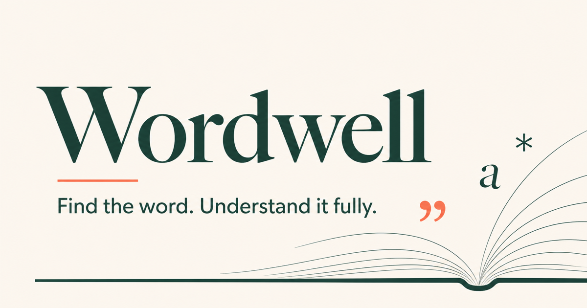

# Wordwell

Wordwell is a responsive dictionary workspace for finding, understanding, and keeping useful words. It combines editorial typography with practical discovery tools: accessible autocomplete, pronunciation, exact rhymes, word meter, related words, saved words, and search history.



## The product challenge

The original dictionary app successfully demonstrated React fundamentals, but its experience was limited to a search field and stacked definition cards. It had no loading or error feedback, invalid searches left stale results on screen, its image API was broken, and the mobile layout did not use the available viewport effectively.

The v2 redesign treats word lookup as a small but complete product:

- **Find:** fast lookup with keyboard-operable autocomplete and shareable URLs.
- **Understand:** clear pronunciation, part-of-speech sections, examples, synonyms, and antonyms.
- **Explore:** Datamuse-powered related words and spelling recovery.
- **Write:** exact rhymes grouped with syllable counts and stress patterns for poetry, lyrics, and children's books.
- **Keep:** saved words and recent searches stored privately on the current device.
- **Recover:** purpose-built loading, not-found, partial-data, and network-error states.

## Design decisions

- A warm editorial visual system makes the experience feel like a contemporary reference tool rather than an admin template.
- Desktop uses a definition-and-sidebar workspace; tablet and mobile progressively collapse to one column.
- The primary search action remains visible and comfortably tappable at every breakpoint.
- Photos were removed because they added latency and visual noise without consistently improving comprehension.
- All optional Datamuse requests fail independently, so a related-word outage never blocks the core definition.

## Accessibility

- Semantic search, article, section, aside, and footer landmarks
- Persistent input label and ARIA combobox relationships
- Arrow-key, Enter, and Escape support for autocomplete
- Live loading and result announcements
- Visible focus styles and touch-friendly controls
- Reduced-motion support
- Text alternatives for icon-only actions

## Data sources

- [Free Dictionary API](https://dictionaryapi.dev/) supplies definitions, phonetics, pronunciation audio, and source links.
- [Datamuse](https://www.datamuse.com/api/) supplies autocomplete, spelling suggestions, synonyms, and antonyms.

Neither integration requires a client-side secret. API access is isolated in `src/services/dictionaryApi.js` so another provider can be introduced without rewriting the interface.

## Stack

- React 19
- Vite
- Vitest and Testing Library
- Lucide icons
- CSS custom properties and native responsive layout
- Browser `localStorage` for device-local saved words and history

## Run locally

```bash
npm install
npm start
```

Run the test suite and production build:

```bash
npm test
npm run build
```

## Product roadmap

- Optional account sync for saved collections
- Word-of-the-day learning mode
- Usage notes and etymology through an authoritative licensed provider
- Installable offline shell with cached recent entries

---

Designed and built by [Tiffany Mackay](https://www.linkedin.com/in/tiffanylmackay/). The project is shared for portfolio and educational use.
